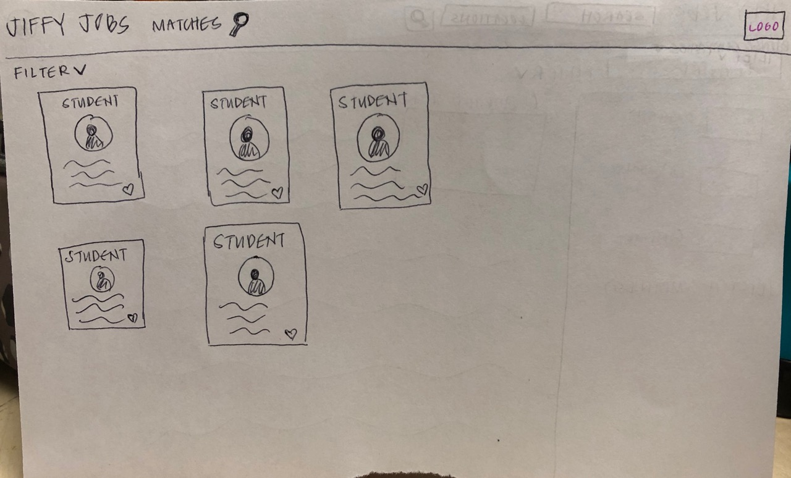
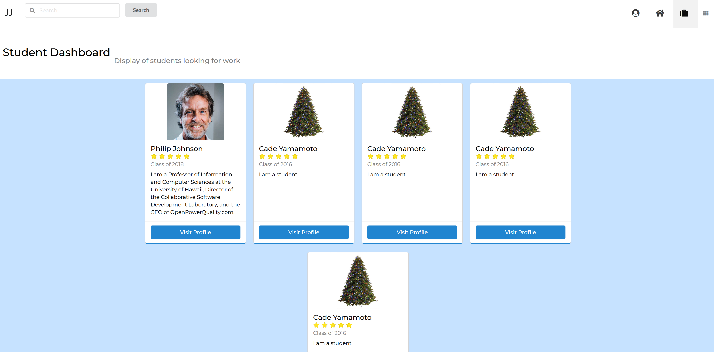

# Project Links
<a href="https://jiffyjobs.meteorapp.com/">Jiffy Jobs</a>

<a href="https://github.com/jiffy-jobs/jiffy-jobs/milestone/1">Milestone 1</a>

<a href="https://github.com/jiffy-jobs/jiffy-jobs/milestone/2">Milestone 2</a>

<a href="https://github.com/jiffy-jobs/jiffy-jobs/milestone/3">Milestone 3</a>
# Table of contents

* [About Jiffy Jobs](#about-jiffy-jobs)
* [User Guide](#user-guide)
* [Developer Guide](#developer-guide)
* [About Us](#about-us)
* [Goals](#goals)
* [Development History](#development-history)

# About Jiffy Jobs

   The UH Manoa students in engineering and computer science are experiencing a major lack of knowledge regarding the jobs or internships that are available and wanting to hire them in or out of college. The only places they can find jobs pertinent to their respective fields is by attending a career fair day or working in one of the limited STEM positions available on campus through the SECE website provided by UH Manoa. The main purpose is to help the engineering and computer science students have more direct line of communication with companies that want to hire them. The students submit their interests which helps match them to employers or vice-versa. The site is built for interactivity between the employers and students to create an engaging and professional environment.

*~Jobs in a jiffy!*

# User Guide
   Currently there are minimal pages to go through. We have the landing page which has two buttons for logging in or signing up. The menu bar at the top is currently non-functional as well as the sidebar however they link to a 404 page wherever necessary. You are able to log in with an account if it has been added and signing up is fully functional as well as differentiates between company and student users. You can use the suitcase in the nav bar as a student to view companies or if you're a company you use it to view students. The profiles are done but we are struggling to add the data into the fields.
   
# Developer Guide
First, [install Meteor](https://www.meteor.com/install).

Second, [download a copy of Jiffy Jobs](https://github.com/jiffy-jobs/jiffy-jobs/archive/master.zip), or clone it using git.
  
Third, cd into the app/ directory and install libraries with:

```
$ meteor npm install
```

Fourth, run the system with:

```
$ meteor npm run start
```

The application should appear at [http://localhost:3000](http://localhost:3000).  

# Goals
* Create a clean and modern landing page. Below is similar to what we had in mind for our landing page:


 
* Provide a profile page for companies that includes information about the company and possible job opportunities.


* Provide a profile page for students that includes general information about the student, customization options, and resume/website links.


* Create a dashboard page that lists all companies/students as cards that includes links to their profile pages & general information.

 
 
 
 
* Create a search page that allows students to search for opportunities and find company profiles.
* Create an admin profile page to manage what companies appear and filter profiles.


* Feed for company announcements and other important information.
* Implement a rating/point system: Students will have a point display in their profile. Students can earn points through accepting internships. Points are distributed by companies through their profiles. Students will have the option to leave starred reviews for a company.

# Development History
<h2> Milestone 1 </h2>
<h3> Landing page created </h3>

* Menu bar working
* Dropdown working


<h3> Login page functional </h3>


<h3> Signup page functional </h3>


<h2> Milestone 2 </h2>


<h3> Company dashboard page functional </h3>



<h3> Student dashboard page functional </h3>


<h3> A basic example of what a student profile will look like </h3>


<h3> A basic example of what a company profile will look like </h3>
* In progress. Mockups have been created for pages and issues have been assigned.

# About Us
The team:

<h3> Cade Yamamoto </h3>


Hello! I am currently a sophomore majoring in computer science at the University of Hawaii at Manoa. Though I intend on pursing a career in cyber security, I enjoy designing aesthetically pleasing web pages. I have adequate knowledge of Semantic UI and React JS and I wish to further my web design skills. My main focus in this project is to implement a modern design with ease-of-use being the primary design aspect of the site. I hope you will enjoy our site!

<h3> Levy Matsuda </h3>


I am currently a sophmore majoring in Computer Science at the University of Hawaii at Manoa. I am considering pursuing a career in web development or computer programming. I have not had prior coding experience. My goal is to become more familiar with React so that eventually, using React becomes more intuitive. I also aim to understand the process behind creating a website better instead of just memorizing code.

<h3> Alexander Wong </h3>


I am currently a Junior majoring in computer science. I am not sure what field I want to go into yet but programming either a website or application sounds interesting to me. I like to design so hopefully through this project I am able to improve my skills in both layouts and coding. 

<h3> Joel Sikkink </h3> 


I am an IT support specialist at ResNet for the Student Housing at Manoa. I bring moderate knowledge of databasing to the team however I am more familiar with SQL rather than MongoDB and I would prefer PHP over Simple Schema and React. This project will hopefully improve my understanding of good website and user based design as I will be creating apps for use by my department at work by next year but I will be using SQL and PHP over the solutions used in this class.  

