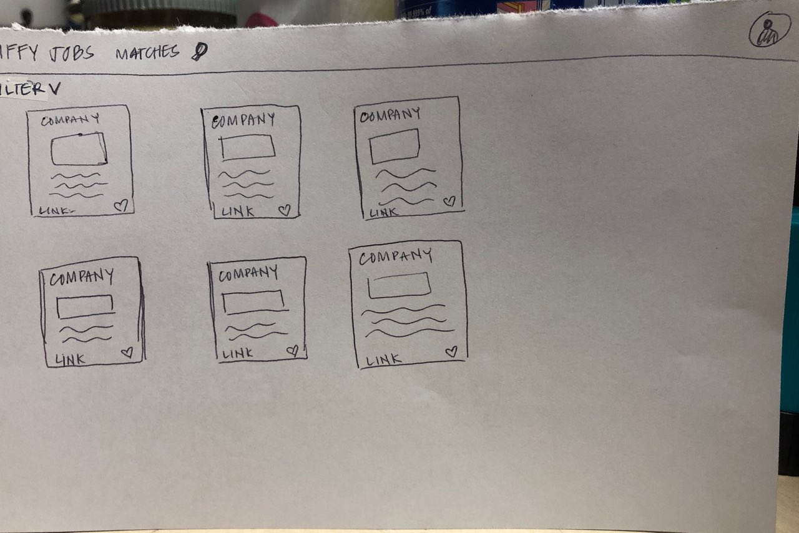

# Project Link
<a href="https://http://jiffyjobs.meteorapp.com/">Jiffy Jobs</a>

# Table of contents

* [About Jiffy Jobs](#about-jiffy-jobs)
* [User Guide](#user-guide)
* [Developer Guide](#developer-guide)
* [About Us](#about-us)
* [Goals](#goals)
* [Development History](#development-history)

# About Jiffy Jobs

   The UH Manoa students in engineering and computer science are experiencing a major lack of knowledge regarding the jobs or internships that are available and wanting to hire them in or out of college. The only places they can find jobs pertinent to their respective fields is by attending a career fair day or working in one of the limited STEM positions available on campus through the SECE website provided by UH Manoa. The main purpose is to help the engineering and computer science students have more direct line of communication with companies that want to hire them. The students submit their interests which helps match them to employers or vice-versa. The site is built for interactivity between the employers and students to create an engaging and professional environment.

*~Jobs in a jiffy!*

# User Guide

# Developer Guide

# About Us

# Goals
* Create a clean and modern landing page. Below is similar to what we had in mind for our landing page:

 
* Provide a profile page for companies that includes information about the company and possible job opportunities.

* Provide a profile page for students that includes general information about the student, customization options, and resume/website links.

* Create a dashboard page that lists all companies/students as cards that includes links to their profile pages & general information.

 
 
 
 
* Create a search page that allows students to search for opporunities and find company profiles.
* Create an admin profile page to manage what companies appear and filter profiles.

* Feed for company announcements and other important information.
* Implement a rating/point system: Students will have a point display in their profile. Students can earn points through accepting internships. Points are distributed by companies through their profiles. Students will have the option to leave starred reviews for a company.

# Development History

